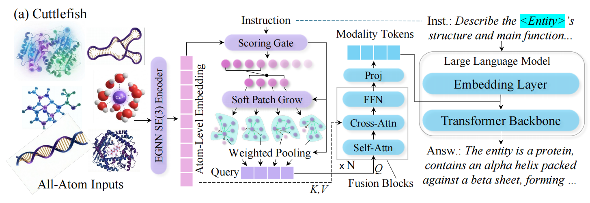

## Cuttlefish: Scaling-Aware Adapter for Structure-Grounded LLM Reasoning

**Status**: This repository is **an anonymized artifact under double-blind review at ICML**. Please do not attempt to deanonymize the authors.

This repo contains the implementation of **Cuttlefish**, a unified all-atom LLM that grounds language reasoning in geometric cues while **scaling structural tokens with structural complexity**.



### Abstract

Large language models (LLMs) are enabling reasoning over biomolecular structures, yet existing methods remain modality-specific and typically compress structural inputs through sequence-based tokenization or fixed-length query connectors. Such architectures either omit the geometric groundings requisite for mitigating structural hallucinations, or impose inflexible modality fusion bottlenecks that concurrently over-compress and suboptimally allocate structural tokens, thereby impeding the realization of generalized all-atom reasoning. We introduce **Cuttlefish**, a unified all-atom LLM that grounds language reasoning in geometric cues while scaling modality tokens with structural complexity. First, **Scaling-Aware Patching** leverages an instruction-conditioned gating mechanism to generate variable-size patches over structural graphs, adaptively scaling the query token budget with structural complexity to mitigate fixed-length connector bottlenecks. Second, **Geometry Grounding Adapter** refines these adaptive tokens via cross-attention to modality embeddings and injects the resulting modality tokens into the LLM, exposing explicit geometric cues to reduce structural hallucination. Experiments across diverse all-atom benchmarks demonstrate that Cuttlefish achieves superior performance in heterogeneous structure-grounded reasoning.


> Note: GitHub Markdown does not reliably render PDFs inline; the PNG above is for inline preview and the PDF link is the high-resolution version.

### What this repo supports

- **Modalities**: protein (PDB/CIF), molecule (SMILES→3D), DNA, RNA
- **Unified parquet data format** across *pretraining* and *instruction tuning*
- **Masked reconstruction pretraining** for the graph encoder
- **Multimodal SFT / benchmarking** via a single entrypoint (`src/runner/sft.py`)
- **Inference** on parquet/JSONL (`src/runner/inference.py`)

For deeper diagrams and additional details, see `docs/README.md` (this top-level README is meant to be runnable on its own).

---

### Install

```bash
python -m pip install -r requirements.txt
```

### Environment setup (recommended)

Some provided scripts expect these env vars to be defined:
- `BASE_DIR`
- `DATA_DIR`
- `CHECKPOINT_DIR`

Use the provided `env.sh` template to set paths and activate your environment (do **not** commit secrets):

```bash
cd /path/to/EntroAdap
source env.sh
```

### Run tests

```bash
pytest -q
```

---

### Data format (unified parquet schema)

**Both pretraining and SFT use the same structural columns.** The only SFT-only addition is `messages`.

#### Core structural columns

| Field | Required | Description |
|------:|:--------:|-------------|
| `modality` | ✓ | `"molecule"`, `"protein"`, `"dna"`, `"rna"` |
| `node_feat` | ✓ | Node/atom features (\(N \times d\)) |
| `pos` | ✓ | 3D coordinates in Å (\(N \times 3\)) |
| `edge_index` | ✓ | Spatial graph edges in COO (\(2 \times E_s\)) |
| `edge_feat_dist` | optional | Distances for spatial edges (\(E_s \times 1\)) |
| `chem_edge_index` | optional | Chemical-bond edges for molecules (\(2 \times E_c\)) |
| `chem_edge_feat_cat` | optional | Chemical-bond categorical features (\(E_c \times 3\)) |

#### SFT-only column: `messages`

For instruction tuning / evaluation, each sample includes a chat-style field:

```python
messages = [
  {"role": "system", "content": "..."},
  {"role": "user", "content": "Question about <STRUCTURE> ..."},
  {"role": "assistant", "content": "..."}
]
```

`<STRUCTURE>` marks where structure embeddings are injected. The runner supports multiple structure tokens (see `src/runner/sft.py` / `src/runner/inference.py`): `["<STRUCTURE>", "<mol>", "<STRUCT>", "<DNA>"]`.

#### Where the repo expects data

The docs use (and most configs assume) paths like:

```text
data/encoder/...   # encoder pretraining parquet(s)
data/sft/...       # SFT parquet(s) with messages
data/benchmark/... # benchmark parquet(s)
```

See also: `docs/README.md` for modality-specific feature details and examples.

---

### Training: masked reconstruction pretraining (graph encoder)

**Entrypoint**: `src/runner/aa_encoder.py`  
**Script wrapper**: `scripts/training/encoder/mlm.sh`  
**Default config**: `configs/aa_encoder/all_modality.yaml`

Run via the wrapper script:

```bash
cd /path/to/EntroAdap
source env.sh

bash scripts/training/encoder/mlm.sh configs/aa_encoder/all_modality.yaml
```

Or run directly:

```bash
python src/runner/aa_encoder.py --config configs/aa_encoder/all_modality.yaml
```

**Notes**
- The config supports multiple parquet files under `data.train_data_path`.
- For multi-modality mixtures, the trainer can enforce **same-modality batches** (`use_modality_sampler: true`).
- Runtime filtering is supported (`max_atoms`, `max_edges`, `skip_on_error`).

---

### Training / tuning: multimodal SFT (Cuttlefish / Octopus wrapper)

**Entrypoint**: `src/runner/sft.py` (train and/or evaluate)  
**Script wrapper**: `scripts/training/ft/octopus.sh`  
**Configs**: `configs/sft/octopus/*.yaml`

Run the provided SFT script (it sequentially runs two configs by default):

```bash
cd /path/to/EntroAdap
source env.sh

bash scripts/training/ft/octopus.sh
```

Run a single config explicitly:

```bash
python src/runner/sft.py --config configs/sft/octopus/octopus_8B_s3_v3.yaml
```

**What `src/runner/sft.py` does**
- Loads a dataset specified by config (`dataset_name`, or train/eval parquet paths depending on config style)
- Tokenizes chat prompts; in multimodal mode it uses `MultiModalDataCollator`
- Trains and/or evaluates depending on config flags (`do_train`, `do_eval`)
- Supports evaluation metrics controlled by `eval_metrics`:
  - `"qa"`: multiple-choice QA metrics
  - `"text"`: text metrics (BLEU/ROUGE/METEOR)

---

### Evaluation / benchmarking

Benchmarks are run through the same `src/runner/sft.py` entrypoint using configs under `configs/benchmark/`.

#### Octopus/Cuttlefish-style multimodal benchmarks

Configs live in `configs/benchmark/octupus/` (e.g., `qa.yaml`, `molgen.yaml`, `retro.yaml`, ...).

Wrapper scripts:
- `scripts/benchmark/forward.sh` → `configs/benchmark/octupus/forward.yaml`
- `scripts/benchmark/molqa.sh` → `configs/benchmark/octupus/qa.yaml`
- `scripts/benchmark/retro.sh` → `configs/benchmark/octupus/retro.yaml`
- `scripts/benchmark/molgen.sh` → `configs/benchmark/octupus/molgen.yaml`
- `scripts/benchmark/mol.sh` → **(currently points to `configs/benchmark/disease.yaml`, which is not present in this artifact; use a config under `configs/benchmark/octupus/` instead)**

Example (QA benchmark):

```bash
cd /path/to/EntroAdap
source env.sh

bash scripts/benchmark/molqa.sh
```

#### Text-only LLM benchmark

`scripts/benchmark/llm.sh` runs:
- `configs/benchmark/llama3/qa.yaml`

```bash
cd /path/to/EntroAdap
source env.sh

bash scripts/benchmark/llm.sh
```

---

### Inference

**Entrypoint**: `src/runner/inference.py`  
**Wrapper**: `scripts/inference/run_inference.sh`  
**Example config**: `configs/inference/octopus_8B_s3_v1_5.yaml`

Run inference via the wrapper:

```bash
cd /path/to/EntroAdap
source env.sh

bash scripts/inference/run_inference.sh
```

Key config fields:
- `input_file`: `.parquet` (unified format) or `.jsonl`
- `octopus_checkpoint_path`: checkpoint directory
- `output_dir`: output **JSONL file path** (despite the name)
- generation params: `max_new_tokens`, `temperature`, `top_p`

There is also a programmatic example in `scripts/inference/run_inference_example.py`.

---

### Useful pointers (code + docs)

- **Full technical docs**: `docs/README.md`
- **Pretraining runner**: `src/runner/aa_encoder.py`
- **SFT/benchmark runner**: `src/runner/sft.py`
- **Inference runner**: `src/runner/inference.py`
- **Data collators / samplers**:
  - `src/data_loader/aa_dataset.py` (masked reconstruction)
  - `src/data_loader/octopus_collator.py` (SFT + inference collators, modality-aware batching)
- **Data builders** (optional; not required if you already have parquet):
  - `src/data_factory/molecule/`
  - `src/data_factory/protein/`
  - `src/data_factory/nacid/`

---

### Dataset

**GEO-AT**: dataset used in the paper (release details to be added after the double-blind period).

### Anonymization / safety notes

- **Do not commit secrets** (API keys, private paths). Keep any local environment setup scripts untracked.
- Keep the artifact **anonymized** until the review process is complete.

### Citation

Citation information will be added after the review process.
